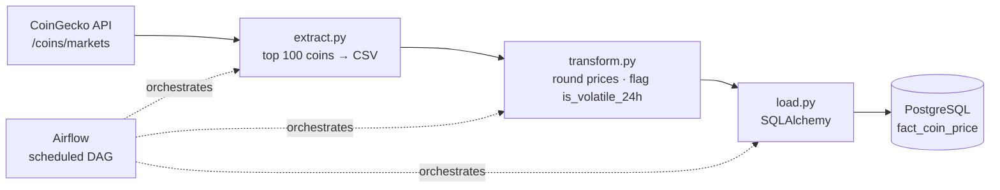

# Crypto ETL Pipeline

**An end-to-end ETL pipeline that pulls live cryptocurrency market data, enriches it, and loads it into a PostgreSQL warehouse** — built in clean, single-responsibility stages (extract → transform → load) and schedulable with Airflow.


---

## Architecture



## Pipeline stages

| Stage | File | What it does |
|-------|------|--------------|
| **Extract** | `extract.py` | Calls the CoinGecko `/coins/markets` API for the top 100 coins by market cap, normalizes the JSON into a flat DataFrame, writes `top_coins.csv` |
| **Transform** | `transform.py` | Parses timestamps, rounds price fields, and derives `is_volatile_24h` (`True` when 24h change > 10%) |
| **Load** | `load.py` | Loads the transformed data into the PostgreSQL fact table `fact_coin_price` via SQLAlchemy |

## Tech stack

Python · pandas · requests · SQLAlchemy · PostgreSQL · Airflow · CoinGecko API

## Quick start

```bash
git clone https://github.com/nitesht2/crypto-etl-pipeline.git
cd crypto-etl-pipeline

python -m venv venv
source venv/bin/activate        # Windows: venv\Scripts\activate
pip install -r requirements.txt
```

Database credentials are read from environment variables — set them before running `load.py`:

```bash
export DB_USER=crypto_user
export DB_PASS=your_password
export DB_HOST=localhost
export DB_PORT=5432
export DB_NAME=crypto_db
```

Then run the pipeline:

```bash
python extract.py     # → top_coins.csv
python transform.py   # → top_coins_transformed.csv
python load.py        # → loads into PostgreSQL fact_coin_price
```

## Data model

The `fact_coin_price` table captures one row per coin per run: `id`, `symbol`, `name`, `current_price`, `market_cap`, `total_volume`, `price_change_percentage_24h`, `price_change_percentage_7d`, `is_volatile_24h`, and `last_updated`. Loading in append mode builds a time series you can query for historical price and volatility trends.

## Scheduling

Wrap the three stages in an Airflow DAG (`extract >> transform >> load`) on a `@daily` or hourly schedule to keep `fact_coin_price` continuously updated.

## License

MIT
