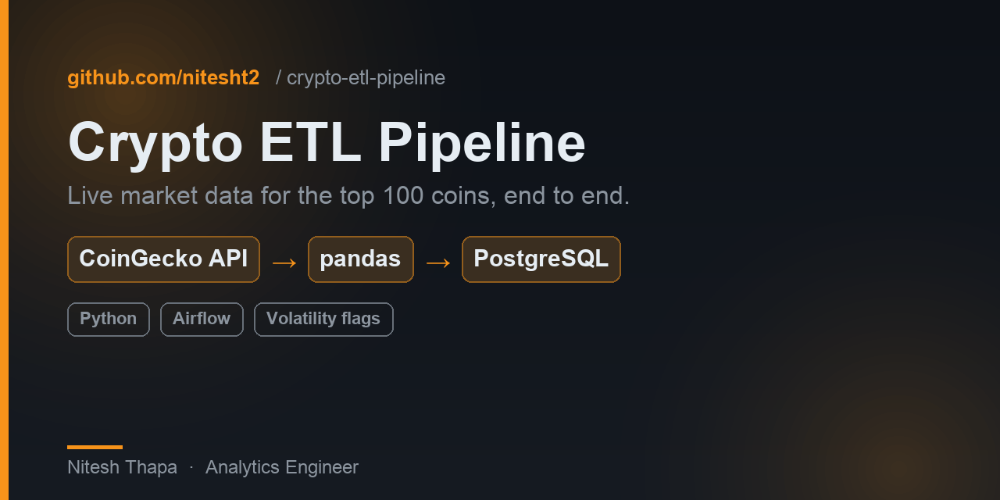
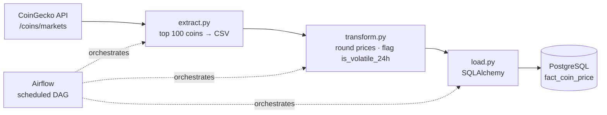

<p align="center">
  
</p>

# Crypto ETL Pipeline

**An end-to-end ETL pipeline that pulls live cryptocurrency market data, enriches it, and loads it into a PostgreSQL warehouse** — built as clean, single-responsibility stages (extract → transform → load) and schedulable with Airflow.


---

## Architecture



**ETL, not ELT:** data is cleaned and enriched in Python *before* it lands, so the warehouse holds analysis-ready rows. Each stage is a standalone script with one job — easy to test, debug, and reuse.

## Pipeline stages

| Stage | File | What it does |
|-------|------|--------------|
| **Extract** | `extract.py` | Calls the CoinGecko `/coins/markets` API for the top 100 coins by market cap, normalizes the JSON into a flat DataFrame, writes `top_coins.csv`. Times out and retries with backoff (the free tier rate-limits). |
| **Transform** | `transform.py` | Parses timestamps, rounds price fields, and derives `is_volatile_24h` (`True` when \|24h change\| > 10%). |
| **Load** | `load.py` | Appends the transformed data to the PostgreSQL fact table `fact_coin_price` via SQLAlchemy. |

## Project structure

```
crypto-etl-pipeline/
├── extract.py             # CoinGecko API  → top_coins.csv
├── transform.py           # clean + derive → top_coins_transformed.csv
├── load.py                # append         → PostgreSQL fact_coin_price
├── db.py                  # SQLAlchemy engine from env vars (no hard-coded secrets)
├── test_query.py          # sanity check: latest rows from the warehouse
├── sql/schema.sql         # fact_coin_price DDL + index (idempotent)
├── dags/crypto_etl_dag.py # Airflow DAG: extract >> transform >> load, @daily
├── .env.example           # credential template (.env is git-ignored)
└── requirements.txt
```

## Quick start

```bash
git clone https://github.com/nitesht2/crypto-etl-pipeline.git
cd crypto-etl-pipeline

python -m venv venv
source venv/bin/activate        # Windows: venv\Scripts\activate
pip install -r requirements.txt
```

Credentials are read from the environment (never hard-coded). Copy the example
file and fill in your values — `.env` is git-ignored:

```bash
cp .env.example .env            # then edit: DB_USER, DB_PASS, DB_HOST, DB_PORT, DB_NAME
```

Create the warehouse table once, then run the pipeline:

```bash
psql -d crypto_db -f sql/schema.sql

python extract.py     # → top_coins.csv
python transform.py   # → top_coins_transformed.csv
python load.py        # → loads into PostgreSQL fact_coin_price
python test_query.py  # → prints the 5 most recent rows
```

## Data model

`fact_coin_price` — **one row per coin per run.** Append mode turns point-in-time API
snapshots into a queryable time series.

| Column | Type | Description |
|--------|------|-------------|
| `id` | text | CoinGecko coin id (e.g. `bitcoin`) |
| `symbol` | text | ticker (e.g. `btc`) |
| `name` | text | display name |
| `current_price` | numeric | price in USD |
| `market_cap` | bigint | market capitalization |
| `total_volume` | bigint | 24-hour trading volume |
| `price_change_percentage_24h` | numeric | % price change, 24h |
| `price_change_percentage_7d` | numeric | % price change, 7d |
| `is_volatile_24h` | boolean | `True` when \|24h change\| > 10% |
| `last_updated` | timestamptz | source timestamp from the API |
| `loaded_at` | timestamptz | when the row was written (defaults to `now()`) |

## Example queries

Once a few runs have loaded:

```sql
-- Most volatile coins in the latest run
SELECT name, price_change_percentage_24h
FROM fact_coin_price
WHERE last_updated = (SELECT MAX(last_updated) FROM fact_coin_price)
  AND is_volatile_24h
ORDER BY ABS(price_change_percentage_24h) DESC
LIMIT 10;

-- Bitcoin's price over time
SELECT last_updated, current_price
FROM fact_coin_price
WHERE id = 'bitcoin'
ORDER BY last_updated;
```

## Design choices

- **Single-responsibility stages** — extract / transform / load are independent and testable; the Airflow DAG calls the *same* functions, so the logic has one source of truth.
- **Secrets via environment** — credentials flow from `.env` through `db.py`; nothing sensitive is committed, and a missing variable fails fast with a clear message.
- **Idempotent setup** — `schema.sql` uses `CREATE TABLE IF NOT EXISTS`, so it's safe to re-run.
- **Append-only loads** — every run adds a snapshot, building history you can trend on.
- **Resilient extract** — the API call has a timeout and retries with backoff for HTTP 429 / 5xx.

## Scheduling

An Airflow DAG is included at [`dags/crypto_etl_dag.py`](dags/crypto_etl_dag.py). It wires
the three stages as `extract >> transform >> load` on a `@daily` schedule (with retries)
so `fact_coin_price` stays continuously updated — drop it into your Airflow `dags/` folder.

## License

MIT
